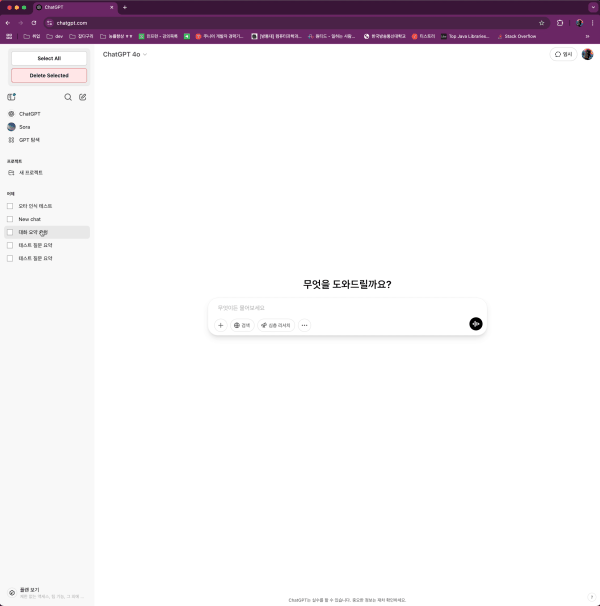

# chatgpt-chat-remover

ChatGPT에서 이전 대화 기록을 빠르게 삭제할 수 있도록 도와주는 크롬 확장 프로그램입니다.  
전체 삭제, 선택 삭제 기능을 지원하며, UI 상에서 간편하게 사용할 수 있습니다.

## 주요 기능

- **전체 삭제**: 기존 채팅 목록 전체 선택 후 삭제
- **선택 삭제**: 원하는 대화만 선택적으로 삭제
- `is_visible: false` 방식으로 API를 통해 채팅 숨김 처리

## 설치 방법

1. 이 저장소를 클론하거나 ZIP으로 다운로드  
2. 크롬 주소창에 `chrome://extensions` 입력  
3. **우측 상단 "개발자 모드" 활성화**  
4. "압축해제된 확장 프로그램 로드" 클릭 → 이 저장소 폴더 선택  
5. ChatGPT 페이지에 접속하면 UI가 자동 삽입됨

## 사용 방법

1. ChatGPT 페이지 좌측 사이드바에 체크박스가 자동으로 표시됩니다.
2. 원하는 대화를 선택하거나 `Select All` 버튼으로 전체 선택합니다.
3. `Delete Selected` 버튼을 누르면 선택한 대화가 즉시 삭제됩니다.

> 실제로는 해당 대화를 삭제하는 것이 아니라 `is_visible: false`로 처리하여 숨기는 방식입니다.

## 작동 방식

- content script에서 ChatGPT DOM 구조를 감지하고 버튼/체크박스 삽입
- 선택된 대화 ID를 `background`에 메시지로 전달
- background에서 accessToken 포함하여 ChatGPT API에 `PATCH` 요청

## 배포 상태

- Chrome Web Store 등록 완료 - [링크](https://chromewebstore.google.com/detail/chatgpt-chat-remover/phmfclnecknfopohajjkdacfhbmhjako?hl=ko&authuser=0)

## License

This project is licensed under the [MIT License](LICENSE).
